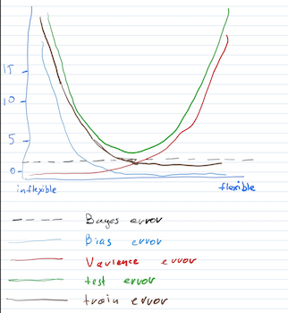

1. Flexible or inflexible  
  a. Better - because we have a lot of data  
  b. Worse - because we don't have enough data and might overfit with flexible approach  
  c. Better - flexible models can represent better non-linear relations  
  d. Worse - flexible model would learn more noise in the data  

3. Bias-Variance tradeoff.  

